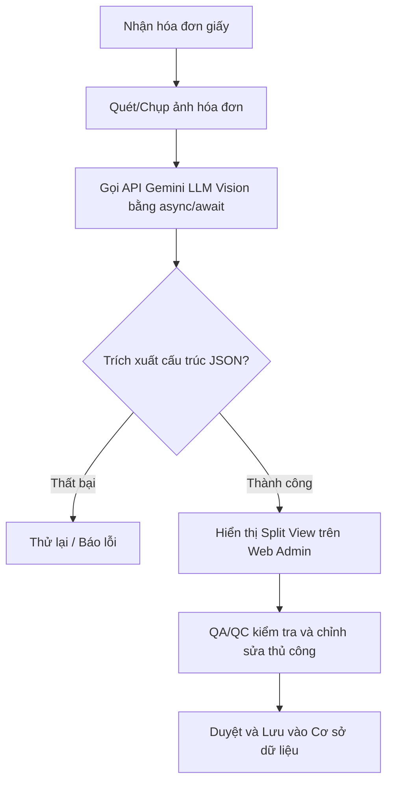

# 📦 HỆ THỐNG QUẢN LÝ KHO MINI FULFILLMENT (WMS MiniFulfillment)

Hệ thống Quản lý Kho nội bộ (**WMS - Warehouse Management System**) tối giản và hiệu quả dành cho các doanh nghiệp vừa và nhỏ (SMEs). Dự án tập trung vào tính cô lập dữ liệu giữa các kho, quản lý tồn kho thời gian thực, tự động hóa quy trình nhập kho bằng AI OCR, và điều hướng xuất kho theo thuật toán FIFO trên ứng dụng di động.

---

## 🎯 Phạm Vi Dự Án (Project Scope)

Dự án được thiết kế chuyên biệt cho **vận hành kho nội bộ (In-house operations)** với quy trình làm việc gồm 3 tác nhân chính:

1. **Nhập kho & Tự động hóa bằng AI (QA/QC & Staff):** Admin lập kế hoạch nhập kho. Nhân viên QA/QC sử dụng **AI OCR (LLM Vision Gemini)** để trích xuất dữ liệu từ hóa đơn giấy và kiểm duyệt. Nhân viên kho sau đó sử dụng ứng dụng di động để quét mã vạch và thực hiện xếp hàng (**Put-away**) vào các Khu vực (**Zones**) chỉ định.
2. **Lưu trữ Đa kho (Admin):** Quản lý kho theo cấu trúc phân cấp phẳng (**Warehouse ➔ Zone**) để tối ưu hóa tốc độ vận hành, loại bỏ cấu hình kệ/ô phức tạp. Tính cô lập dữ liệu được đảm bảo tuyệt đối thông qua **Global Query Filters** (mỗi nhân viên chỉ thấy dữ liệu thuộc kho mình được gán).
3. **Xuất kho & Bàn giao (Staff):** Điều hướng nhân viên nhặt hàng (**Picking**) trên Mobile App theo thuật toán **FIFO (First-In-First-Out)**. Quy trình kết thúc bằng trạng thái bàn giao nội bộ để theo dõi vận chuyển cơ bản.

> [!NOTE]
> Để bảo toàn tính toàn vẹn của lõi tồn kho, hệ thống **không** tích hợp với các sàn thương mại điện tử bên ngoài, API vận chuyển của bên thứ ba, hoặc cổng thanh toán tài chính.

---

## 🏗 Kiến Trúc Hệ Thống (Monorepo)

Dự án được tổ chức theo mô hình **Monorepo** bao gồm 3 ứng dụng chính:

```text
WMS_MiniFulfillment/
├── backend/                  # .NET 10 Web API (Monolithic)
│   ├── WMS.Domain/           # Thực thể (Entities), Enums, Exceptions (Không chứa thư viện ngoài)
│   ├── WMS.Application/      # Use Cases, DTOs, Services (Thuật toán FIFO, Xử lý OCR)
│   ├── WMS.Infrastructure/   # EF Core DbContext, Repositories, API tích hợp Gemini AI
│   └── WMS.API/              # Controllers, Program.cs, Middlewares (JWT, DI)
├── web-admin/                # ReactJS + Vite + TypeScript (Bảng điều khiển Admin & QA/QC)
└── mobile-app/               # React Native + Expo + TypeScript (Ứng dụng cho nhân viên kho)
```

### Cơ sở Dữ liệu & ORM
- **Entity Framework Core 10** đóng vai trò ORM kết nối với **SQL Server**.
- Cấu hình DbContext được đặt tại `backend/WMS.Infrastructure/Data/ApplicationDbContext.cs`.
- Migrations được thực hiện từ tầng API trỏ đến tầng Infrastructure.

---

## 📜 BỘ LUẬT PHÁT TRIỂN HỆ THỐNG (DEVELOPMENT RULES)

> [!IMPORTANT]
> Toàn bộ lập trình viên và tác nhân AI tham gia phát triển dự án bắt buộc phải tuân thủ nghiêm ngặt các quy tắc dưới đây. Bất kỳ sự vi phạm nào đều bị coi là lỗi nghiêm trọng (**Fatal Error**).

### 1. Kiến Trúc Phần Mềm (Clean Architecture 4 Tầng)
- Hệ thống sử dụng kiến trúc **Monolithic**. Tuyệt đối **KHÔNG** tự ý áp dụng Microservices, Kafka hoặc RabbitMQ.
- Tuân thủ cấu trúc 4 tầng trong Backend:
  1. **Domain:** Chỉ chứa Entities, Enums, Exceptions. Không phụ thuộc vào bất kỳ thư viện bên ngoài nào.
  2. **Application:** Chứa Interfaces (`IRepository`, `IAiOcrService`), DTOs, Use Cases/Services. Chỉ được phép phụ thuộc vào Domain.
  3. **Infrastructure:** Chứa EF Core DbContext, Repository Implementations, External APIs (Gemini).
  4. **API:** Chứa Controllers, Middlewares. Chỉ được gọi trực tiếp xuống tầng Application.

### 2. Quy Tắc Backend & Database (.NET EF Core)
- **Cấu trúc dữ liệu Tồn kho:** Bảng `Inventory` (Tồn kho) là trái tim của hệ thống. 
  $$\text{Inventory} = \text{ProductId} + \text{WarehouseId} + \text{ZoneId} + \text{Quantity}$$
  *Tuyệt đối KHÔNG lưu trữ cột `Quantity` (Số lượng) trực tiếp trong bảng `Products`.* Mọi thực thể giao dịch (`Receipt`, `Issue`, `Inventory`...) bắt buộc phải có `WarehouseId`.
- **Bảo mật & Phân quyền (RBAC):**
  - Sử dụng cơ chế Token đôi: **Access Token** (ngắn hạn) + **Refresh Token** (lưu ở Database). Cung cấp sẵn API `/refresh-token` để gia hạn.
  - Các API được bảo vệ nghiêm ngặt bằng attribute `[Authorize(Roles="...")]`. Token Payload bắt buộc phải chứa claim `Role` và `WarehouseId`.
- **Định tuyến API (Routing):** Khai báo Route tường minh và tuyệt đối **KHÔNG** sử dụng dấu ngoặc vuông bọc tên biến trong đường dẫn cấp cao nhằm chống lỗi phân quyền 403.
  - ✅ Đúng: `[Route("api/Users")]`, `[Route("api/Receipts")]`
  - ❌ Sai: `[Route("api/[controller]")]`, `[Route("api/[Users]")]`
- **Tránh Race Condition & Tối ưu Hiệu năng:**
  - Bắt buộc sử dụng cơ chế **Concurrency Token** (`RowVersion` hoặc `Quantity`) của EF Core kết hợp với `IDbContextTransaction` khi thực hiện xuất/nhập kho nhằm tránh xung đột dữ liệu. Không dùng `lock` thuần túy của C#.
  - Luôn thêm `.AsNoTracking()` cho tất cả các API GET danh sách hoặc chi tiết không yêu cầu thay đổi trạng thái.
  - Bắt buộc cấu hình **Global Query Filter** trong `DbContext` để tự động lọc `WarehouseId` từ JWT Token. Nghiêm cấm code thủ công `.Where(x => x.WarehouseId == id)` ở tầng Service.

### 3. Quy Tắc Web Admin (React Vite + Ant Design)
- **Thư viện UI & CSS:** Bắt buộc sử dụng **Ant Design**. Tuyệt đối không viết inline-style hoặc file `.css` thuần. Dùng `<Space>`, `<Row>`, `<Col>` của AntD để dàn bố cục layout.
- **Base Components:** Cấm gọi trực tiếp `<Button>`, `<Table>`. Bắt buộc import các components chuẩn được bọc sẵn: `<PrimaryButton>`, `<BaseTable>`, `<PageHeader>` từ `src/components`.
- **Quản lý Form State:** Bắt buộc sử dụng `Form.useForm()` và `Form.useWatch` của Ant Design.
- **Layout Đồng nhất:**
  - Thanh tìm kiếm (SearchBar) luôn nằm ở góc trên **BÊN TRÁI**.
  - Các nút hành động chính (Thêm mới, Lưu) luôn nằm ở góc trên **BÊN PHẢI**.
  - Cột hành động trong Table (Sửa/Xóa) phải được gộp chung vào một cột duy nhất nằm ngoài cùng bên phải.
- **Giao diện AI OCR (Split View):** Bắt buộc chia đôi màn hình:
  - **Bên Trái:** File ảnh hóa đơn có chức năng Zoom.
  - **Bên Phải:** Form dữ liệu JSON có viền đỏ cảnh báo những thông tin cần QA/QC kiểm duyệt lại.

### 4. Quy Tắc Mobile App (React Native + Expo + Paper)
- **Bố cục UI:** Bắt buộc bọc tất cả các màn hình trong `<SafeAreaView>`. Nút bấm sử dụng `mode="contained"`, chữ hiển thị lớn, độ tương phản cao để nhân viên dễ thao tác trong kho.
- **Base Components:** Bắt buộc sử dụng các thành phần dùng chung được tối ưu cho kho: `<ScannerButton>`, `<TaskCard>`, `<ScannerHeader>` từ `src/components`.
- **Điều hướng (React Navigation):** Thuộc tính `name` của Route phân biệt chính xác **HOA/thường** và phải khớp 100% với chuỗi ký tự được sử dụng trong hàm `navigation.navigate()`.
- **Xử lý Barcode (Camera):**
  - Áp dụng cơ chế **Debounce/Throttle** khóa Camera trong **2 giây** sau khi quét thành công để chống hiện tượng quét đúp (Double Scan).
  - Kích hoạt rung thiết bị (`Vibration.vibrate()`) và nhấp nháy đỏ màn hình nếu quét sai mã hoặc xảy ra lỗi.
- **Xử lý Mạng:** Cấu hình **Axios Interceptors** để tự động bắt lỗi 401 (Unauthorized), thực hiện gọi ngầm API Refresh Token và gửi lại request cũ (retry) mà không bắt người dùng phải đăng nhập lại hoặc thao tác lại từ đầu.

---

## ⚙️ LUỒNG NGHIỆP VỤ ĐẶC BIỆT

### 1. Thuật Toán FIFO Xuất Kho (`GeneratePickingPlanService`)
Khi lập kế hoạch nhặt hàng để xuất kho, hệ thống tự động thực hiện:
1. Truy vấn số lượng tồn kho `Inventory` theo mã sản phẩm `ProductId`.
2. Sắp xếp danh sách vị trí lưu trữ tăng dần theo ngày nhập hàng: `OrderBy(LastRestockedDate ASC)`.
3. Tiến hành trừ lùi số lượng cần xuất tại từng Khu vực (`Zone`) cũ nhất cho đến khi đáp ứng đủ số lượng yêu cầu `TotalNeeded`.

### 2. Quy Trình AI OCR Hóa Đơn
Quy trình nhận diện hóa đơn sử dụng công nghệ LLM Vision hoạt động theo cơ chế **Human in the Loop**:

- Việc gọi API Gemini bắt buộc phải sử dụng `async/await`.
- Prompt được tinh chỉnh để ép phản hồi trả về định dạng JSON thuần túy.
- Xử lý Deserialize trong khối `try-catch` để tránh crash hệ thống.

---

## 🚀 HƯỚNG DẪN CÀI ĐẶT & CHẠY NHANH (QUICK START)

### 📋 Điều kiện tiên quyết
- Cài đặt [.NET 10 SDK](https://dotnet.microsoft.com/download/dotnet/10.0)
- Cài đặt [Node.js](https://nodejs.org/) (Khuyên dùng bản LTS)
- SQL Server (Địa phương hoặc Docker)

---

### 🗄️ 1. Cấu hình Backend (.NET 10)

1. Di chuyển vào thư mục `backend`:
   ```bash
   cd backend
   ```
2. Cập nhật chuỗi kết nối cơ sở dữ liệu `DefaultConnection` trong file `WMS.API/appsettings.json` (hoặc cấu hình qua User Secrets).
3. Thực hiện cập nhật Cơ sở dữ liệu bằng lệnh Entity Framework Core:
   ```bash
   dotnet ef database update --project WMS.Infrastructure --startup-project WMS.API
   ```
4. Khởi chạy máy chủ API:
   ```bash
   dotnet run --project WMS.API
   ```
   *API mặc định chạy tại địa chỉ `http://localhost:5000` hoặc `https://localhost:5001` (vui lòng kiểm tra cổng chi tiết hiển thị trên terminal).*

---

### 💻 2. Khởi chạy Web Admin (React Vite)

1. Mở một terminal mới và di chuyển vào thư mục `web-admin`:
   ```bash
   cd web-admin
   ```
2. Cài đặt các gói phụ thuộc:
   ```bash
   npm install
   ```
3. Tạo file cấu hình môi trường `.env.local` dựa trên file mẫu `.env.example`, cập nhật đường dẫn API:
   ```env
   VITE_API_URL=http://localhost:5000/api
   ```
4. Khởi chạy máy chủ phát triển:
   ```bash
   npm run dev
   ```
   *Bảng điều khiển Web Admin sẽ hoạt động tại địa chỉ: `http://localhost:5173`*

---

### 📱 3. Khởi chạy Mobile App (Expo)

1. Mở một terminal mới và di chuyển vào thư mục `mobile-app`:
   ```bash
   cd mobile-app
   ```
2. Cài đặt các gói phụ thuộc:
   ```bash
   npm install
   ```
3. Cấu hình địa chỉ IP máy chủ API trong file cấu hình môi trường của bạn.
4. Khởi chạy ứng dụng bằng Expo:
   ```bash
   npx expo start
   ```
5. Quét mã QR hiển thị trên màn hình terminal bằng ứng dụng **Expo Go** (trên điện thoại vật lý Android/iOS), hoặc nhấn phím `a` để chạy trên trình giả lập Android.

---

## 🚨 NHỮNG ĐIỀU CẤM KỴ (RED LINES)

- 🚫 **KHÔNG** cho phép tầng API gọi trực tiếp DbContext.
- 🚫 **KHÔNG** cập nhật trực tiếp số lượng tồn kho vào bảng `Products` (Mọi biến động phải thông qua bảng `Inventory` và `InventoryTransaction`).
- 🚫 **KHÔNG** viết logic xử lý nghiệp vụ bên trong Controller.
- 🚫 **KHÔNG** đẩy các thư mục tạm hoặc tệp tin rác lên hệ thống kiểm soát phiên bản Git (Bắt buộc bỏ qua `bin/`, `obj/`, `node_modules/`, `.expo/`, `.vs/`).
