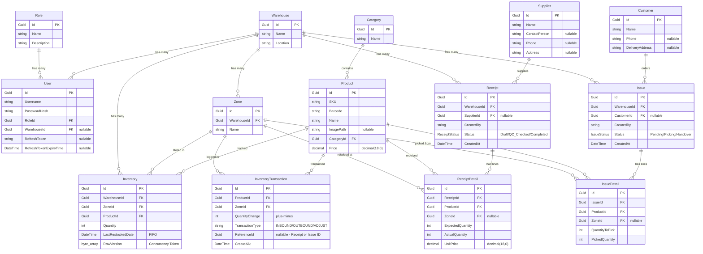
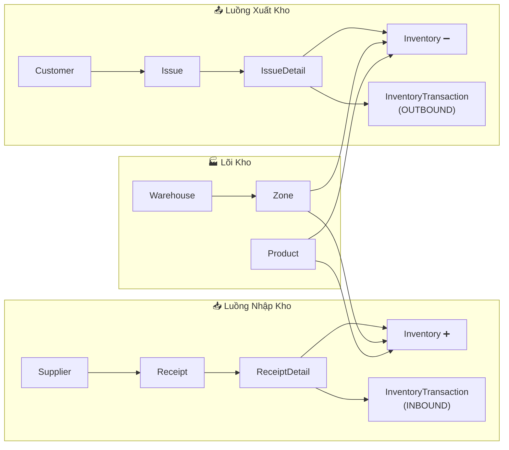
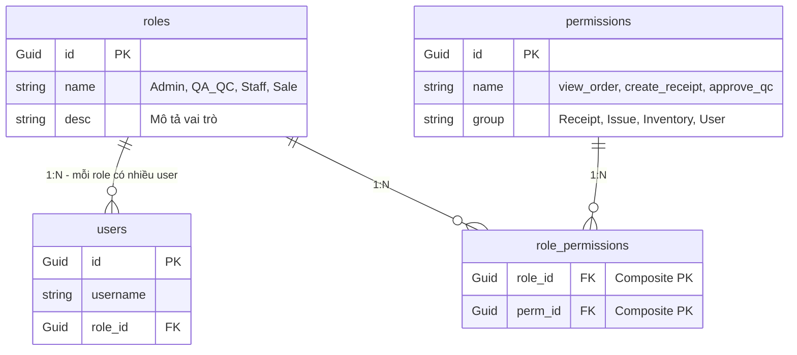

# 📊 Thiết Kế Database — WMS Mini Fulfillment

> Tài liệu mô tả toàn bộ cấu trúc Entities, sơ đồ quan hệ (ER Diagram), và các ghi chú thiết kế được trích xuất từ source code dự án **WMS_MiniFulfillment**.

---

## 1. Sơ Đồ Quan Hệ (ER Diagram)



---

## 2. Bản Thiết Kế Chi Tiết Entities

### 2.1 Nhóm Quản lý Người dùng & Phân quyền

---

#### 🔑 Role
> Vai trò người dùng trong hệ thống.

| Thuộc tính | Kiểu dữ liệu | Ràng buộc | Mô tả |
|---|---|---|---|
| `Id` | `Guid` | **PK** | Khóa chính |
| `Name` | `string` | Required | Tên vai trò (`Admin`, `QA_QC`, `Staff`) |
| `Description` | `string` | Required | Mô tả vai trò |

📎 **Source**: [Role.cs](file:///e:/chuyende%202026/WMS_MiniFulfillment/backend/WMS.Domain/Entities/Role.cs)

---

#### 👤 User
> Người dùng hệ thống, liên kết với Role và Warehouse.

| Thuộc tính | Kiểu dữ liệu | Ràng buộc | Mô tả |
|---|---|---|---|
| `Id` | `Guid` | **PK** | Khóa chính |
| `Username` | `string` | Required | Tên đăng nhập |
| `PasswordHash` | `string` | Required | Mật khẩu đã mã hóa |
| `RoleId` | `Guid` | **FK → Role** | Vai trò của user |
| `WarehouseId` | `Guid?` | **FK → Warehouse**, nullable | Kho phụ trách (null nếu Admin) |
| `RefreshToken` | `string?` | Nullable | Token làm mới phiên |
| `RefreshTokenExpiryTime` | `DateTime?` | Nullable | Thời hạn của Refresh Token |

> [!NOTE]
> `WarehouseId` nullable vì **Admin quản lý tổng**, không thuộc kho nào cụ thể. Cơ chế bảo mật sử dụng **Token kép** (Access + Refresh).

📎 **Source**: [User.cs](file:///e:/chuyende%202026/WMS_MiniFulfillment/backend/WMS.Domain/Entities/User.cs)

---

### 2.2 Nhóm Kho & Vị trí

---

#### 🏭 Warehouse
> Thông tin kho hàng.

| Thuộc tính | Kiểu dữ liệu | Ràng buộc | Mô tả |
|---|---|---|---|
| `Id` | `Guid` | **PK** | Khóa chính |
| `Name` | `string` | Required | Tên kho |
| `Location` | `string` | Required | Địa chỉ kho |

📎 **Source**: [Warehouse.cs](file:///e:/chuyende%202026/WMS_MiniFulfillment/backend/WMS.Domain/Entities/Warehouse.cs)

---

#### 📍 Zone
> Khu vực trong kho (ví dụ: kệ, tầng, lối đi).

| Thuộc tính | Kiểu dữ liệu | Ràng buộc | Mô tả |
|---|---|---|---|
| `Id` | `Guid` | **PK** | Khóa chính |
| `WarehouseId` | `Guid` | **FK → Warehouse** | Kho chứa zone |
| `Name` | `string` | Required | Tên khu vực |

📎 **Source**: [Zone.cs](file:///e:/chuyende%202026/WMS_MiniFulfillment/backend/WMS.Domain/Entities/Zone.cs)

---

### 2.3 Nhóm Sản phẩm & Danh mục

---

#### 📂 Category
> Danh mục sản phẩm.

| Thuộc tính | Kiểu dữ liệu | Ràng buộc | Mô tả |
|---|---|---|---|
| `Id` | `Guid` | **PK** | Khóa chính |
| `Name` | `string` | Required | Tên danh mục |

📎 **Source**: [Category.cs](file:///e:/chuyende%202026/WMS_MiniFulfillment/backend/WMS.Domain/Entities/Category.cs)

---

#### 📦 Product
> Sản phẩm được quản lý trong kho.

| Thuộc tính | Kiểu dữ liệu | Ràng buộc | Mô tả |
|---|---|---|---|
| `Id` | `Guid` | **PK** | Khóa chính |
| `SKU` | `string` | Required | Mã quản lý kho (Stock Keeping Unit) |
| `Barcode` | `string` | Required | Mã vạch sản phẩm |
| `Name` | `string` | Required | Tên sản phẩm |
| `ImagePath` | `string?` | Nullable | Đường dẫn ảnh sản phẩm |
| `CategoryId` | `Guid` | **FK → Category** | Danh mục sản phẩm |
| `Price` | `decimal(18,0)` | Required | Giá sản phẩm |

📎 **Source**: [Product.cs](file:///e:/chuyende%202026/WMS_MiniFulfillment/backend/WMS.Domain/Entities/Product.cs)

---

### 2.4 Nhóm Đối tác

---

#### 🚚 Supplier
> Nhà cung cấp hàng hóa.

| Thuộc tính | Kiểu dữ liệu | Ràng buộc | Mô tả |
|---|---|---|---|
| `Id` | `Guid` | **PK** | Khóa chính |
| `Name` | `string` | Required | Tên nhà cung cấp |
| `ContactPerson` | `string?` | Nullable | Người liên hệ |
| `Phone` | `string?` | Nullable | Số điện thoại |
| `Address` | `string?` | Nullable | Địa chỉ |

📎 **Source**: [Supplier.cs](file:///e:/chuyende%202026/WMS_MiniFulfillment/backend/WMS.Domain/Entities/Supplier.cs)

---

#### 🧑‍💼 Customer
> Khách hàng nhận hàng.

| Thuộc tính | Kiểu dữ liệu | Ràng buộc | Mô tả |
|---|---|---|---|
| `Id` | `Guid` | **PK** | Khóa chính |
| `Name` | `string` | Required | Tên khách hàng |
| `Phone` | `string?` | Nullable | Số điện thoại |
| `DeliveryAddress` | `string?` | Nullable | Địa chỉ giao hàng |

📎 **Source**: [Customer.cs](file:///e:/chuyende%202026/WMS_MiniFulfillment/backend/WMS.Domain/Entities/Customer.cs)

---

### 2.5 Nhóm Tồn kho

---

#### 📊 Inventory
> Tồn kho hiện tại — theo Product × Zone × Warehouse.

| Thuộc tính | Kiểu dữ liệu | Ràng buộc | Mô tả |
|---|---|---|---|
| `Id` | `Guid` | **PK** | Khóa chính |
| `WarehouseId` | `Guid` | **FK → Warehouse** | Kho |
| `ZoneId` | `Guid` | **FK → Zone** | Khu vực |
| `ProductId` | `Guid` | **FK → Product** | Sản phẩm |
| `Quantity` | `int` | Required | Số lượng tồn |
| `LastRestockedDate` | `DateTime` | Required | Ngày nhập cuối (dùng cho **FIFO**) |
| `RowVersion` | `byte[]` | **Concurrency Token** | Chống Race Condition (EF Core tự quản lý) |

> [!IMPORTANT]
> `RowVersion` được cấu hình là **Concurrency Token** trong DbContext để chống xung đột khi nhiều người cùng cập nhật tồn kho.

📎 **Source**: [Inventory.cs](file:///e:/chuyende%202026/WMS_MiniFulfillment/backend/WMS.Domain/Entities/Inventory.cs)

---

#### 📝 InventoryTransaction
> Lịch sử giao dịch tồn kho (Nhập / Xuất / Điều chỉnh).

| Thuộc tính | Kiểu dữ liệu | Ràng buộc | Mô tả |
|---|---|---|---|
| `Id` | `Guid` | **PK** | Khóa chính |
| `ProductId` | `Guid` | **FK → Product** | Sản phẩm |
| `ZoneId` | `Guid` | **FK → Zone** | Khu vực |
| `QuantityChange` | `int` | Required | Thay đổi số lượng (`+` nhập, `-` xuất) |
| `TransactionType` | `string` | Required | Loại: `INBOUND`, `OUTBOUND`, `ADJUST` |
| `ReferenceId` | `Guid?` | Nullable | ID tham chiếu (Receipt hoặc Issue) |
| `CreatedAt` | `DateTime` | Default: `UtcNow` | Thời điểm giao dịch |

> [!NOTE]
> `ReferenceId` không có FK constraint cứng — nó có thể trỏ tới `Receipt.Id` hoặc `Issue.Id` tùy `TransactionType`.

📎 **Source**: [InventoryTransaction.cs](file:///e:/chuyende%202026/WMS_MiniFulfillment/backend/WMS.Domain/Entities/InventoryTransaction.cs)

---

### 2.6 Nhóm Nhập kho (Inbound)

---

#### 📥 Receipt
> Phiếu nhập kho.

| Thuộc tính | Kiểu dữ liệu | Ràng buộc | Mô tả |
|---|---|---|---|
| `Id` | `Guid` | **PK** | Khóa chính |
| `WarehouseId` | `Guid` | **FK → Warehouse** | Kho nhập |
| `SupplierId` | `Guid?` | **FK → Supplier**, nullable | Nhà cung cấp |
| `CreatedBy` | `string` | Required | Người tạo phiếu |
| `Status` | `ReceiptStatus` | Default: `Draft` | Trạng thái phiếu |
| `CreatedAt` | `DateTime` | Default: `UtcNow` | Ngày tạo |

📎 **Source**: [Receipt.cs](file:///e:/chuyende%202026/WMS_MiniFulfillment/backend/WMS.Domain/Entities/Receipt.cs)

---

#### 📋 ReceiptDetail
> Chi tiết dòng hàng trong phiếu nhập.

| Thuộc tính | Kiểu dữ liệu | Ràng buộc | Mô tả |
|---|---|---|---|
| `Id` | `Guid` | **PK** | Khóa chính |
| `ReceiptId` | `Guid` | **FK → Receipt** | Phiếu nhập cha |
| `ProductId` | `Guid` | **FK → Product** | Sản phẩm |
| `ZoneId` | `Guid?` | **FK → Zone**, nullable | Khu vực xếp hàng |
| `ExpectedQuantity` | `int` | Required | Số lượng kỳ vọng |
| `ActualQuantity` | `int` | Required | Số lượng thực nhận |
| `UnitPrice` | `decimal(18,0)` | Required | Đơn giá |

📎 **Source**: [ReceiptDetail.cs](file:///e:/chuyende%202026/WMS_MiniFulfillment/backend/WMS.Domain/Entities/ReceiptDetail.cs)

---

### 2.7 Nhóm Xuất kho (Outbound)

---

#### 📤 Issue
> Phiếu xuất kho.

| Thuộc tính | Kiểu dữ liệu | Ràng buộc | Mô tả |
|---|---|---|---|
| `Id` | `Guid` | **PK** | Khóa chính |
| `WarehouseId` | `Guid` | **FK → Warehouse** | Kho xuất |
| `CustomerId` | `Guid?` | **FK → Customer**, nullable | Khách hàng |
| `CreatedBy` | `string` | Required | Người tạo phiếu |
| `Status` | `IssueStatus` | Default: `Pending` | Trạng thái phiếu |
| `CreatedAt` | `DateTime` | Default: `UtcNow` | Ngày tạo |

📎 **Source**: [Issue.cs](file:///e:/chuyende%202026/WMS_MiniFulfillment/backend/WMS.Domain/Entities/Issue.cs)

---

#### 📋 IssueDetail
> Chi tiết dòng hàng trong phiếu xuất.

| Thuộc tính | Kiểu dữ liệu | Ràng buộc | Mô tả |
|---|---|---|---|
| `Id` | `Guid` | **PK** | Khóa chính |
| `IssueId` | `Guid` | **FK → Issue** | Phiếu xuất cha |
| `ProductId` | `Guid` | **FK → Product** | Sản phẩm |
| `ZoneId` | `Guid?` | **FK → Zone**, nullable | Khu vực lấy hàng |
| `QuantityToPick` | `int` | Required | Số lượng cần lấy |
| `PickedQuantity` | `int` | Required | Số lượng đã lấy thực tế |

📎 **Source**: [IssueDetail.cs](file:///e:/chuyende%202026/WMS_MiniFulfillment/backend/WMS.Domain/Entities/IssueDetail.cs)

---

## 3. Enums

### IssueStatus
> Trạng thái phiếu xuất kho.

| Giá trị | Mô tả |
|---|---|
| `Pending` | Chờ xử lý |
| `Picking` | Đang lấy hàng |
| `Handover` | Đã bàn giao |

📎 **Source**: [IssueStatus.cs](file:///e:/chuyende%202026/WMS_MiniFulfillment/backend/WMS.Domain/Enums/IssueStatus.cs)

### ReceiptStatus
> Trạng thái phiếu nhập kho.

| Giá trị | Mô tả |
|---|---|
| `Draft` | Nháp (mới tạo) |
| `QC_Checked` | Đã kiểm tra QC |
| `Completed` | Hoàn thành |

📎 **Source**: [ReceiptStatus.cs](file:///e:/chuyende%202026/WMS_MiniFulfillment/backend/WMS.Domain/Enums/ReceiptStatus.cs)

---

## 4. Tổng Hợp Quan Hệ

| Quan hệ | Kiểu | FK tại | Mô tả |
|---|---|---|---|
| **Role → User** | 1 : N | `User.RoleId` | Mỗi Role có nhiều User |
| **Warehouse → User** | 1 : N | `User.WarehouseId` (nullable) | Mỗi Warehouse có nhiều User |
| **Warehouse → Zone** | 1 : N | `Zone.WarehouseId` | Mỗi Warehouse có nhiều Zone |
| **Warehouse → Inventory** | 1 : N | `Inventory.WarehouseId` | Tồn kho theo Warehouse |
| **Warehouse → Receipt** | 1 : N | `Receipt.WarehouseId` | Phiếu nhập thuộc Warehouse |
| **Warehouse → Issue** | 1 : N | `Issue.WarehouseId` | Phiếu xuất thuộc Warehouse |
| **Category → Product** | 1 : N | `Product.CategoryId` | Sản phẩm thuộc danh mục |
| **Product → Inventory** | 1 : N | `Inventory.ProductId` | Tồn kho theo Product |
| **Product → InventoryTransaction** | 1 : N | `InventoryTransaction.ProductId` | Lịch sử giao dịch theo Product |
| **Product → ReceiptDetail** | 1 : N | `ReceiptDetail.ProductId` | Dòng nhập theo Product |
| **Product → IssueDetail** | 1 : N | `IssueDetail.ProductId` | Dòng xuất theo Product |
| **Zone → Inventory** | 1 : N | `Inventory.ZoneId` | Tồn kho theo Zone |
| **Zone → InventoryTransaction** | 1 : N | `InventoryTransaction.ZoneId` | Giao dịch tại Zone |
| **Zone → ReceiptDetail** | 1 : N | `ReceiptDetail.ZoneId` (nullable) | Nhập hàng vào Zone |
| **Zone → IssueDetail** | 1 : N | `IssueDetail.ZoneId` (nullable) | Xuất hàng từ Zone |
| **Supplier → Receipt** | 1 : N | `Receipt.SupplierId` (nullable) | Phiếu nhập từ Supplier |
| **Customer → Issue** | 1 : N | `Issue.CustomerId` (nullable) | Phiếu xuất cho Customer |
| **Receipt → ReceiptDetail** | 1 : N | `ReceiptDetail.ReceiptId` | Phiếu nhập có nhiều dòng |
| **Issue → IssueDetail** | 1 : N | `IssueDetail.IssueId` | Phiếu xuất có nhiều dòng |

---

## 5. Sơ Đồ Luồng Dữ Liệu Chính



---

## 6. Ghi Chú Thiết Kế Quan Trọng

### 6.1 Global Query Filter theo WarehouseId

Hệ thống áp dụng **Global Query Filter** trên 6 entities để tự động lọc dữ liệu theo `WarehouseId` từ JWT Token của user hiện tại:

| Entity | Cách lọc |
|---|---|
| `Inventory` | Trực tiếp qua `WarehouseId` |
| `Receipt` | Trực tiếp qua `WarehouseId` |
| `Issue` | Trực tiếp qua `WarehouseId` |
| `InventoryTransaction` | Gián tiếp qua `Zone.WarehouseId` |
| `ReceiptDetail` | Gián tiếp qua `Receipt.WarehouseId` |
| `IssueDetail` | Gián tiếp qua `Issue.WarehouseId` |

> [!IMPORTANT]
> Điều này đảm bảo **mỗi user chỉ thấy dữ liệu thuộc kho của mình** — trừ Admin (không có `WarehouseId` → thấy toàn bộ).

📎 **Source**: [ApplicationDbContext.cs](file:///e:/chuyende%202026/WMS_MiniFulfillment/backend/WMS.Infrastructure/Data/ApplicationDbContext.cs#L50-L96)

### 6.2 Cascade Delete = Restrict

Toàn bộ FK trong hệ thống được cấu hình **`DeleteBehavior.Restrict`** để tránh lỗi **Multiple Cascade Paths** trong SQL Server. Nghĩa là không thể xóa entity cha nếu còn entity con tham chiếu.

📎 **Source**: [ApplicationDbContext.cs](file:///e:/chuyende%202026/WMS_MiniFulfillment/backend/WMS.Infrastructure/Data/ApplicationDbContext.cs#L36-L41)

### 6.3 Concurrency Control (Optimistic Locking)

Entity `Inventory` sử dụng **`RowVersion`** (timestamp) làm **Concurrency Token**. EF Core tự động:
- Gửi `RowVersion` trong mệnh đề `WHERE` khi `UPDATE`
- Ném `DbUpdateConcurrencyException` nếu giá trị không khớp (do người khác đã cập nhật trước)

Điều này **chống Race Condition** khi nhiều request đồng thời cập nhật tồn kho.

### 6.4 FIFO (First In, First Out)

Trường `Inventory.LastRestockedDate` được sử dụng để hỗ trợ thuật toán **FIFO** — hàng nhập trước sẽ được xuất trước.

### 6.5 Polymorphic Reference

`InventoryTransaction.ReferenceId` là một **Polymorphic FK** — không có ràng buộc FK cứng trong DB, mà tùy theo `TransactionType`:
- `INBOUND` → `ReferenceId` trỏ đến `Receipt.Id`
- `OUTBOUND` → `ReferenceId` trỏ đến `Issue.Id`
- `ADJUST` → `ReferenceId` có thể null

---

## 7. Thống Kê

| Metric | Giá trị |
|---|---|
| Tổng số Entity | **14** |
| Tổng số Enum | **2** |
| Tổng số quan hệ FK | **19** |
| DbSet trong DbContext | **14** |
| Global Query Filters | **6** |
| Concurrency Token | **1** (Inventory.RowVersion) |

---

## 8. 🔍 Phân Tích Lỗi Thiết Kế & Đề Xuất Cải Tiến

> Phần này phân tích các vấn đề thiết kế database **không hợp lý so với hệ thống WMS thực tế**, được phát hiện bằng cách đối chiếu Entities, DbContext, Migration Snapshot, Services và Controllers.

---

### 🔴 Lỗi 1: `CreatedBy` là `string`, không FK tới `User`

**Hiện trạng**: Cả `Receipt.CreatedBy` và `Issue.CreatedBy` đều là `string`, lưu giá trị từ `_currentUser.GetCurrentUserId()` (trả về `string?`).

**Tại sao sai**:
- Không có ràng buộc tham chiếu → có thể lưu giá trị rác ("system", username bị xóa, v.v.)
- Không thể JOIN để lấy thông tin người tạo (tên, role, kho)
- Vi phạm nguyên tắc toàn vẹn dữ liệu quan hệ

**Bằng chứng**: Trong [OperationControllers.cs](file:///e:/chuyende%202026/WMS_MiniFulfillment/backend/WMS.API/Controllers/OperationControllers.cs#L52), giá trị `createdBy` fallback thành `"system"` — một chuỗi tùy ý không đại diện cho user thực.

**Đề xuất sửa**:
```diff
  public class Receipt {
-     public string CreatedBy { get; set; } = string.Empty;
+     public Guid CreatedByUserId { get; set; }
+     public User? CreatedByUser { get; set; }
  }
```

> [!IMPORTANT]
> Nên áp dụng tương tự cho `Issue.CreatedBy`. Thay `string` bằng `Guid CreatedByUserId` với FK → User.

---

### 🔴 Lỗi 2: Thiếu Unique Constraint trên `Product.SKU`, `Product.Barcode`, `User.Username`

**Hiện trạng**: Trong [ApplicationDbContextModelSnapshot.cs](file:///e:/chuyende%202026/WMS_MiniFulfillment/backend/WMS.Infrastructure/Migrations/ApplicationDbContextModelSnapshot.cs#L196-L228), cả `SKU`, `Barcode` đều có kiểu `nvarchar(max)` — **không có index, không có unique constraint**.

**Tại sao sai**:
- **SKU** và **Barcode** là mã định danh nghiệp vụ — bắt buộc phải unique trong hệ thống WMS thực
- Hệ thống có API `GetByBarcode` ([MasterDataControllers.cs:168](file:///e:/chuyende%202026/WMS_MiniFulfillment/backend/WMS.API/Controllers/MasterDataControllers.cs#L168)) nhưng **không có index** → truy vấn full table scan
- `Username` cũng cần unique — hiện tại có thể tạo 2 user trùng username
- Kiểu `nvarchar(max)` không thể đánh index trong SQL Server (tối đa 900 bytes)

**Đề xuất sửa**:
```csharp
// Trong OnModelCreating
modelBuilder.Entity<Product>(e => {
    e.Property(p => p.SKU).HasMaxLength(50);
    e.HasIndex(p => p.SKU).IsUnique();
    
    e.Property(p => p.Barcode).HasMaxLength(50);
    e.HasIndex(p => p.Barcode).IsUnique();
});

modelBuilder.Entity<User>(e => {
    e.Property(u => u.Username).HasMaxLength(100);
    e.HasIndex(u => u.Username).IsUnique();
});
```

---

### 🔴 Lỗi 3: Thiếu Unique Composite Index trên `Inventory (WarehouseId, ZoneId, ProductId)`

**Hiện trạng**: Bảng `Inventories` chỉ có index đơn trên từng cột FK riêng lẻ (xem [snapshot L88-L94](file:///e:/chuyende%202026/WMS_MiniFulfillment/backend/WMS.Infrastructure/Migrations/ApplicationDbContextModelSnapshot.cs#L88-L94)).

**Tại sao sai**:
- Về logic nghiệp vụ, **mỗi sản phẩm trong một zone của một kho chỉ nên có DUY NHẤT một bản ghi tồn kho**
- Trong service [CompletePutAway](file:///e:/chuyende%202026/WMS_MiniFulfillment/backend/WMS.Infrastructure/Services/Operations/OperationServices.cs#L168-L169), code kiểm tra `FirstOrDefaultAsync(i => i.ProductId == ... && i.ZoneId == ... && i.WarehouseId == ...)` — nếu thiếu unique index, race condition có thể tạo **duplicate records**
- Bản thân `RowVersion` chỉ chống concurrent UPDATE, **không chống concurrent INSERT**

**Đề xuất sửa**:
```csharp
modelBuilder.Entity<Inventory>(e => {
    e.HasIndex(i => new { i.WarehouseId, i.ZoneId, i.ProductId }).IsUnique();
});
```

---

### 🟠 Lỗi 4: `decimal(18,0)` — Giá tiền không có phần thập phân

**Hiện trạng**: Cả `Product.Price` và `ReceiptDetail.UnitPrice` đều được cấu hình `[Column(TypeName = "decimal(18,0)")]`.

**Tại sao sai**:
- `decimal(18,0)` nghĩa là **0 chữ số thập phân** → giá `15500.50` sẽ bị làm tròn thành `15501`
- Đây là lỗi phổ biến — trong hệ thống WMS thực, đơn giá cần ít nhất 2 chữ số thập phân (hoặc 4 cho tỷ giá)

**Đề xuất sửa**:
```diff
- [Column(TypeName = "decimal(18,0)")]
+ [Column(TypeName = "decimal(18,2)")]
  public decimal Price { get; set; }
```

> [!NOTE]
> Nếu hệ thống chỉ dùng VNĐ (không có phần lẻ), thì `decimal(18,0)` có thể chấp nhận được. Tuy nhiên nên dùng `decimal(18,2)` để linh hoạt cho tương lai.

---

### 🟠 Lỗi 5: `InventoryTransaction.TransactionType` là `string`, nên là `Enum`

**Hiện trạng**: `TransactionType` có kiểu `string` với các giá trị hardcode `"INBOUND"`, `"OUTBOUND"`, `"ADJUST"` trong service.

**Tại sao sai**:
- Dễ gõ sai (ví dụ: `"Inbound"` vs `"INBOUND"`) → lỗi nghiệp vụ im lặng
- Không có validation ở tầng DB
- Không nhất quán với `IssueStatus` và `ReceiptStatus` đã dùng enum

**Đề xuất sửa**:
```csharp
// Thêm enum mới
public enum TransactionType { Inbound, Outbound, Adjust }

// Sửa entity
public class InventoryTransaction {
    public TransactionType TransactionType { get; set; }
}
```

---

### 🟠 Lỗi 6: `ConfirmPick` sử dụng `detail.ZoneId` thay vì ZoneId từ Picking Plan

**Hiện trạng**: Trong [ConfirmPickAsync](file:///e:/chuyende%202026/WMS_MiniFulfillment/backend/WMS.Infrastructure/Services/Operations/OperationServices.cs#L491-L492):
```csharp
var inv = await _db.Inventories.FirstOrDefaultAsync(i =>
    i.ProductId == detail.ProductId && i.ZoneId == detail.ZoneId && ...);
```

**Tại sao sai**:
- `IssueDetail.ZoneId` ban đầu **null** khi tạo Issue (xem [CreateAsync L424-L431](file:///e:/chuyende%202026/WMS_MiniFulfillment/backend/WMS.Infrastructure/Services/Operations/OperationServices.cs#L424-L431) — không set `ZoneId`)
- `ZoneId` chỉ được gán sau bước Picking Plan, nhưng Picking Plan **không cập nhật lại `IssueDetail.ZoneId`** vào DB
- Khi FIFO split allocation xảy ra (1 sản phẩm lấy từ nhiều zone), `detail.ZoneId` chỉ lưu 1 zone → **mất thông tin các zone còn lại**
- `ConfirmPickRequest` không chứa `ZoneId` → không biết pick từ zone nào

**Đề xuất sửa**:
```diff
  public record ConfirmPickRequest(
      Guid IssueDetailId,
+     Guid ZoneId,
      int PickedQuantity
  );
```

---

### 🟠 Lỗi 7: Thiếu Navigation Collection ở một số Entity cha

**Hiện trạng** (từ [ModelSnapshot](file:///e:/chuyende%202026/WMS_MiniFulfillment/backend/WMS.Infrastructure/Migrations/ApplicationDbContextModelSnapshot.cs)):
- `Warehouse` → chỉ có `Navigation("Users")`, **thiếu Zones, Inventories, Receipts, Issues**
- `Supplier` → **thiếu** `ICollection<Receipt> Receipts`
- `Customer` → **thiếu** `ICollection<Issue> Issues`
- `Product` → **thiếu** `ICollection<Inventory>`, `ICollection<ReceiptDetail>`, `ICollection<IssueDetail>`

**Tại sao sai**:
- EF Core cấu hình `WithMany()` (anonymous) thay vì `WithMany(x => x.Receipts)` → relationship ánh xạ đúng nhưng **không có reverse navigation**
- Không ảnh hưởng tính đúng của DB, nhưng gây khó khăn khi cần truy vấn ngược (ví dụ: lấy tất cả phiếu nhập của 1 supplier)

**Đề xuất sửa**: Thêm navigation collections vào các entity cha:
```csharp
// Warehouse.cs
public ICollection<Zone> Zones { get; set; } = new List<Zone>();
public ICollection<Inventory> Inventories { get; set; } = new List<Inventory>();

// Supplier.cs  
public ICollection<Receipt> Receipts { get; set; } = new List<Receipt>();

// Customer.cs
public ICollection<Issue> Issues { get; set; } = new List<Issue>();
```

---

### 🟡 Lỗi 8: Thiếu Audit Trail (`UpdatedAt`) và Mã phiếu (`ReceiptCode`, `IssueCode`)

**Hiện trạng**: Các entity `Receipt`, `Issue` có `CreatedAt` nhưng **không có `UpdatedAt`**. Ngoài ra, không có mã phiếu dạng đọc được (ví dụ: `PN-20260605-001`, `PX-20260605-001`).

**Tại sao sai trong hệ thống thực**:
- **UpdatedAt**: Không biết lần cuối phiếu được chỉnh sửa khi nào — quan trọng cho audit/compliance
- **Mã phiếu**: Trong thực tế kho vận, nhân viên trao đổi bằng mã phiếu đọc được ("phiếu nhập số PN-001"), không ai dùng GUID (`3fa85f64-5717-4562-b3fc-2c963f66afa6`)

**Đề xuất sửa**:
```csharp
public class Receipt {
    // Thêm
    public string ReceiptCode { get; set; } = string.Empty; // "PN-20260605-001"
    public DateTime? UpdatedAt { get; set; }
}

public class Issue {
    public string IssueCode { get; set; } = string.Empty; // "PX-20260605-001"
    public DateTime? UpdatedAt { get; set; }
}
```

---

### 🟡 Lỗi 9: Không có `MaxLength` trên bất kỳ trường `string` nào

**Hiện trạng**: Toàn bộ trường string trong DB đều là `nvarchar(max)` (xem [ModelSnapshot](file:///e:/chuyende%202026/WMS_MiniFulfillment/backend/WMS.Infrastructure/Migrations/ApplicationDbContextModelSnapshot.cs)).

**Tại sao sai**:
- `nvarchar(max)` chiếm **8000+ bytes** mỗi trường → lãng phí storage
- Không thể đánh **Unique Index** trên `nvarchar(max)` trong SQL Server
- Không có validation ở tầng DB → user có thể submit tên sản phẩm 1 triệu ký tự
- Ảnh hưởng hiệu suất query (SQL Server không thể optimize `nvarchar(max)` tốt như `nvarchar(n)`)

**Đề xuất sửa**:

| Entity.Field | MaxLength hợp lý |
|---|---|
| `User.Username` | 100 |
| `User.PasswordHash` | 256 |
| `Product.SKU` | 50 |
| `Product.Barcode` | 50 |
| `Product.Name` | 200 |
| `Role.Name` | 50 |
| `Warehouse.Name` | 200 |
| `Zone.Name` | 100 |
| `Category.Name` | 100 |
| `Supplier.Name` | 200 |
| `Customer.Name` | 200 |
| `InventoryTransaction.TransactionType` | 20 |

---

### 🟡 Lỗi 10: `Role` Seed Data có 4 vai trò nhưng `Authorize` chỉ dùng 3

**Hiện trạng**: [DbInitializer.cs](file:///e:/chuyende%202026/WMS_MiniFulfillment/backend/WMS.Infrastructure/Data/DbInitializer.cs#L57-L65) seed **4 roles**: `Admin`, `QA_QC`, `Staff`, `Manager`.

Nhưng trong toàn bộ Controllers, `[Authorize(Roles = ...)]` chỉ dùng 3:
- `"Admin"` — tạo phiếu, CRUD master data
- `"QA_QC,Admin"` — duyệt QC, OCR  
- `"Staff,Admin"` — cất hàng, nhặt hàng

**Role `Manager` không xuất hiện trong bất kỳ `Authorize` nào** → user có role `Manager` bị **block hết tất cả API** (chỉ có thể `GetAll`/`GetById` vì chúng chỉ yêu cầu `[Authorize]`).

**Đề xuất sửa**: Xác định rõ quyền của `Manager`:
- Nếu `Manager` = `Admin` thu hẹp → thêm vào các `Authorize` attribute
- Nếu không dùng → bỏ khỏi seed data để tránh nhầm lẫn

---

## 9. Tổng Hợp Mức Độ Ưu Tiên Sửa Lỗi

| # | Lỗi | Mức độ | Ảnh hưởng | Cần Migration? |
|---|---|---|---|---|
| 1 | `CreatedBy` string, không FK | 🔴 Cao | Toàn vẹn dữ liệu | ✅ |
| 2 | Thiếu Unique trên SKU/Barcode/Username | 🔴 Cao | Dữ liệu trùng, performance | ✅ |
| 3 | Thiếu Composite Unique trên Inventory | 🔴 Cao | Race condition, dữ liệu trùng | ✅ |
| 4 | `decimal(18,0)` cho giá tiền | 🟠 Trung bình | Mất phần thập phân | ✅ |
| 5 | TransactionType string thay vì enum | 🟠 Trung bình | Lỗi gõ sai, không validate | ✅ |
| 6 | ConfirmPick thiếu ZoneId | 🟠 Trung bình | Bug nghiệp vụ FIFO split | ❌ (chỉ sửa code) |
| 7 | Thiếu Navigation Collections | 🟡 Thấp | DX kém, query khó | ❌ (chỉ sửa entity) |
| 8 | Thiếu UpdatedAt, mã phiếu | 🟡 Thấp | Audit trail, UX | ✅ |
| 9 | Thiếu MaxLength | 🟡 Thấp | Storage, performance | ✅ |
| 10 | Role Manager không dùng | 🟡 Thấp | Nhầm lẫn phân quyền | ❌ |
| **11** | **Thiếu bảng Permissions + RolePermissions** | **🔴 Cao** | **Không đáp ứng yêu cầu RBAC** | **✅** |

---

## 10. 🚨 Lỗi Nghiêm Trọng: Thiếu Mô Hình Phân Quyền Động (RBAC)

> [!CAUTION]
> Theo yêu cầu thiết kế, hệ thống cần 4 bảng phân quyền: `roles`, `users`, `permissions`, `role_permissions`. Hiện tại **thiếu 2 bảng**: `permissions` và `role_permissions`.

### 10.1 So Sánh Yêu Cầu vs Hiện Trạng

| Bảng theo yêu cầu | Cột yêu cầu | Hiện trạng trong code | Kết quả |
|---|---|---|---|
| `roles` | id, name, desc | ✅ `Role` (Id, Name, Description) | **Đúng** |
| `users` | id, username, role_id | ✅ `User` (Id, Username, RoleId, ...) | **Đúng** (có thêm trường phụ) |
| `permissions` | id, name, group | ❌ **Không tồn tại** | **🔴 THIẾU** |
| `role_permissions` | role_id, perm_id | ❌ **Không tồn tại** | **🔴 THIẾU** |

### 10.2 Phân Tích Vấn Đề

**Yêu cầu** thiết kế theo mô hình **RBAC (Role-Based Access Control) động**:



**Hiện trạng** — quyền bị **hardcode trong C# code**, không nằm trong database:

```csharp
// ❌ Cách hiện tại — phải sửa code + deploy lại nếu muốn đổi quyền
[Authorize(Roles = "Admin")]           // Chỉ Admin mới tạo phiếu
[Authorize(Roles = "QA_QC,Admin")]     // QA_QC hoặc Admin duyệt QC  
[Authorize(Roles = "Staff,Admin")]     // Staff hoặc Admin cất/nhặt hàng
```

**Hậu quả**:

| Vấn đề | Giải thích |
|---|---|
| **Không linh hoạt** | Muốn cho Staff tạo phiếu nhập → phải sửa code, build, deploy lại |
| **Không quản lý được từ UI** | Admin không thể bật/tắt quyền từ web-admin |
| **Không đáp ứng yêu cầu** | Đề bài yêu cầu bảng `permissions` + `role_permissions` nhưng chưa có |
| **Role Manager vô dụng** | Được seed nhưng không có quyền nào vì hardcode thiếu |

### 10.3 Sơ Đồ Quan Hệ Đúng (Bổ Sung 2 Bảng Thiếu)

```mermaid
erDiagram
    Role ||--o{ User : "has many"
    Role ||--o{ RolePermission : "has many"
    Permission ||--o{ RolePermission : "has many"
    Warehouse ||--o{ User : "has many"

    Role {
        Guid Id PK
        string Name "Admin, QA_QC, Staff, Manager"
        string Description
    }

    User {
        Guid Id PK
        string Username UK
        string PasswordHash
        Guid RoleId FK
        Guid WarehouseId FK "nullable"
        string RefreshToken "nullable"
        DateTime RefreshTokenExpiryTime "nullable"
    }

    Permission {
        Guid Id PK
        string Name UK "create_receipt, approve_qc, pick_item"
        string Group "Receipt, Issue, Inventory, User"
    }

    RolePermission {
        Guid RoleId FK-PK "Composite PK"
        Guid PermissionId FK-PK "Composite PK"
    }
```

---

### 10.4 Hướng Giải Quyết Chi Tiết

#### Bước 1: Tạo Entity `Permission`

📁 Tạo file mới: `WMS.Domain/Entities/Permission.cs`

```csharp
namespace WMS.Domain.Entities;

public class Permission
{
    public Guid Id { get; set; }
    
    /// <summary>Tên quyền, ví dụ: "create_receipt", "approve_qc", "view_inventory"</summary>
    public string Name { get; set; } = string.Empty;
    
    /// <summary>Nhóm quyền, ví dụ: "Receipt", "Issue", "Inventory", "User"</summary>
    public string Group { get; set; } = string.Empty;
    
    // Navigation
    public ICollection<RolePermission> RolePermissions { get; set; } = new List<RolePermission>();
}
```

#### Bước 2: Tạo Entity `RolePermission` (bảng trung gian N:N)

📁 Tạo file mới: `WMS.Domain/Entities/RolePermission.cs`

```csharp
namespace WMS.Domain.Entities;

public class RolePermission
{
    public Guid RoleId { get; set; }
    public Role? Role { get; set; }
    
    public Guid PermissionId { get; set; }
    public Permission? Permission { get; set; }
}
```

#### Bước 3: Cập nhật Entity `Role` — thêm navigation

📁 Sửa file: `WMS.Domain/Entities/Role.cs`

```diff
  public class Role {
      public Guid Id { get; set; }
      public string Name { get; set; } = string.Empty;
      public string Description { get; set; } = string.Empty;
      public ICollection<User> Users { get; set; } = new List<User>();
+     public ICollection<RolePermission> RolePermissions { get; set; } = new List<RolePermission>();
  }
```

#### Bước 4: Cấu hình DbContext

📁 Sửa file: `WMS.Infrastructure/Data/ApplicationDbContext.cs`

```csharp
// Thêm DbSet
public DbSet<Permission> Permissions { get; set; }
public DbSet<RolePermission> RolePermissions { get; set; }

// Trong OnModelCreating — cấu hình Composite PK + Unique
modelBuilder.Entity<RolePermission>(e =>
{
    // Composite Primary Key (role_id + perm_id)
    e.HasKey(rp => new { rp.RoleId, rp.PermissionId });
    
    e.HasOne(rp => rp.Role)
     .WithMany(r => r.RolePermissions)
     .HasForeignKey(rp => rp.RoleId)
     .OnDelete(DeleteBehavior.Restrict);
    
    e.HasOne(rp => rp.Permission)
     .WithMany(p => p.RolePermissions)
     .HasForeignKey(rp => rp.PermissionId)
     .OnDelete(DeleteBehavior.Restrict);
});

modelBuilder.Entity<Permission>(e =>
{
    e.Property(p => p.Name).HasMaxLength(100);
    e.HasIndex(p => p.Name).IsUnique(); // Tên quyền phải unique
    e.Property(p => p.Group).HasMaxLength(50);
});
```

#### Bước 5: Seed Data — Tạo danh sách quyền mặc định

📁 Sửa file: `WMS.Infrastructure/Data/DbInitializer.cs`

```csharp
private static async Task EnsurePermissionsAsync(ApplicationDbContext context)
{
    if (await context.Permissions.AnyAsync()) return;

    // Định nghĩa tất cả permissions theo nhóm
    var permissions = new List<Permission>
    {
        // --- Nhóm Receipt (Nhập kho) ---
        new() { Id = Guid.NewGuid(), Name = "create_receipt",   Group = "Receipt" },
        new() { Id = Guid.NewGuid(), Name = "view_receipt",     Group = "Receipt" },
        new() { Id = Guid.NewGuid(), Name = "approve_qc",       Group = "Receipt" },
        new() { Id = Guid.NewGuid(), Name = "complete_putaway",  Group = "Receipt" },
        new() { Id = Guid.NewGuid(), Name = "run_ocr",          Group = "Receipt" },

        // --- Nhóm Issue (Xuất kho) ---
        new() { Id = Guid.NewGuid(), Name = "create_issue",     Group = "Issue" },
        new() { Id = Guid.NewGuid(), Name = "view_issue",       Group = "Issue" },
        new() { Id = Guid.NewGuid(), Name = "generate_picking",  Group = "Issue" },
        new() { Id = Guid.NewGuid(), Name = "confirm_pick",     Group = "Issue" },
        new() { Id = Guid.NewGuid(), Name = "handover",         Group = "Issue" },

        // --- Nhóm Inventory (Tồn kho) ---
        new() { Id = Guid.NewGuid(), Name = "view_inventory",   Group = "Inventory" },
        new() { Id = Guid.NewGuid(), Name = "adjust_inventory",  Group = "Inventory" },
        new() { Id = Guid.NewGuid(), Name = "view_transactions", Group = "Inventory" },

        // --- Nhóm Master Data ---
        new() { Id = Guid.NewGuid(), Name = "manage_products",   Group = "MasterData" },
        new() { Id = Guid.NewGuid(), Name = "manage_warehouses", Group = "MasterData" },
        new() { Id = Guid.NewGuid(), Name = "manage_zones",      Group = "MasterData" },
        new() { Id = Guid.NewGuid(), Name = "manage_suppliers",  Group = "MasterData" },
        new() { Id = Guid.NewGuid(), Name = "manage_customers",  Group = "MasterData" },
        new() { Id = Guid.NewGuid(), Name = "manage_categories", Group = "MasterData" },

        // --- Nhóm User Management ---
        new() { Id = Guid.NewGuid(), Name = "manage_users",      Group = "User" },
        new() { Id = Guid.NewGuid(), Name = "manage_roles",      Group = "User" },

        // --- Nhóm Analytics ---
        new() { Id = Guid.NewGuid(), Name = "view_analytics",   Group = "Analytics" },
    };

    context.Permissions.AddRange(permissions);
    await context.SaveChangesAsync();

    // Gán quyền cho từng Role
    var allPerms = await context.Permissions.ToListAsync();
    var roles = await context.Roles.ToListAsync();

    var admin = roles.First(r => r.Name == "Admin");
    var qaqc  = roles.First(r => r.Name == "QA_QC");
    var staff = roles.First(r => r.Name == "Staff");

    // Admin → tất cả quyền
    foreach (var p in allPerms)
        context.RolePermissions.Add(new RolePermission 
            { RoleId = admin.Id, PermissionId = p.Id });

    // QA_QC → xem + duyệt QC + OCR
    var qaqcPerms = new[] { "view_receipt", "approve_qc", "run_ocr", 
                            "view_issue", "view_inventory", "view_transactions",
                            "view_analytics" };
    foreach (var name in qaqcPerms)
    {
        var p = allPerms.First(x => x.Name == name);
        context.RolePermissions.Add(new RolePermission 
            { RoleId = qaqc.Id, PermissionId = p.Id });
    }

    // Staff → xem + thao tác kho (cất hàng, nhặt hàng, bàn giao)
    var staffPerms = new[] { "view_receipt", "complete_putaway",
                             "view_issue", "generate_picking", "confirm_pick", "handover",
                             "view_inventory", "view_transactions" };
    foreach (var name in staffPerms)
    {
        var p = allPerms.First(x => x.Name == name);
        context.RolePermissions.Add(new RolePermission 
            { RoleId = staff.Id, PermissionId = p.Id });
    }

    await context.SaveChangesAsync();
}
```

#### Bước 6: Thay đổi cơ chế Authorization — từ hardcode sang dynamic

📁 Tạo file mới: `WMS.API/Authorization/PermissionRequirement.cs`

```csharp
using Microsoft.AspNetCore.Authorization;

// 1. Định nghĩa yêu cầu quyền
public class PermissionRequirement : IAuthorizationRequirement
{
    public string Permission { get; }
    public PermissionRequirement(string permission) => Permission = permission;
}

// 2. Handler kiểm tra quyền từ DB
public class PermissionHandler : AuthorizationHandler<PermissionRequirement>
{
    private readonly IServiceScopeFactory _scopeFactory;

    public PermissionHandler(IServiceScopeFactory scopeFactory)
        => _scopeFactory = scopeFactory;

    protected override async Task HandleRequirementAsync(
        AuthorizationHandlerContext context, PermissionRequirement requirement)
    {
        var roleClaim = context.User.FindFirst(ClaimTypes.Role)?.Value;
        if (roleClaim is null) return;

        using var scope = _scopeFactory.CreateScope();
        var db = scope.ServiceProvider.GetRequiredService<ApplicationDbContext>();

        // Query DB: Role này có Permission yêu cầu không?
        var hasPermission = await db.RolePermissions
            .Include(rp => rp.Role)
            .Include(rp => rp.Permission)
            .AnyAsync(rp => rp.Role!.Name == roleClaim 
                         && rp.Permission!.Name == requirement.Permission);

        if (hasPermission)
            context.Succeed(requirement);
    }
}
```

📁 Đăng ký trong `Program.cs`:

```csharp
// Đăng ký handler
builder.Services.AddSingleton<IAuthorizationHandler, PermissionHandler>();

// Đăng ký policy cho mỗi permission
builder.Services.AddAuthorization(options =>
{
    options.AddPolicy("create_receipt", policy =>
        policy.Requirements.Add(new PermissionRequirement("create_receipt")));
    options.AddPolicy("approve_qc", policy =>
        policy.Requirements.Add(new PermissionRequirement("approve_qc")));
    // ... tương tự cho các permission khác
});
```

#### Bước 7: Cập nhật Controllers — dùng Policy thay Roles

📁 Sửa các Controllers:

```diff
  // TRƯỚC — hardcode role
- [Authorize(Roles = "Admin")]
  public async Task<ActionResult> Create(...)

  // SAU — dynamic permission từ DB
+ [Authorize(Policy = "create_receipt")]
  public async Task<ActionResult> Create(...)
```

**Bảng ánh xạ cụ thể**:

| Controller | Action | Trước (Roles) | Sau (Policy) |
|---|---|---|---|
| `ReceiptsController` | Create | `"Admin"` | `"create_receipt"` |
| `ReceiptsController` | ApproveQc | `"QA_QC,Admin"` | `"approve_qc"` |
| `ReceiptsController` | CompletePutAway | `"Staff,Admin"` | `"complete_putaway"` |
| `ReceiptsController` | RunOcr | `"QA_QC,Admin"` | `"run_ocr"` |
| `IssuesController` | Create | `"Admin"` | `"create_issue"` |
| `IssuesController` | GetPickingPlan | `"Staff,Admin"` | `"generate_picking"` |
| `IssuesController` | ConfirmPick | `"Staff,Admin"` | `"confirm_pick"` |
| `IssuesController` | Handover | `"Staff,Admin"` | `"handover"` |
| `InventoryController` | Adjust | `"Admin"` | `"adjust_inventory"` |
| `ProductsController` | Create/Update/Delete | `"Admin"` | `"manage_products"` |
| `WarehousesController` | Create/Update/Delete | `"Admin"` | `"manage_warehouses"` |
| `UsersController` | All | `"Admin"` | `"manage_users"` |

#### Bước 8: Chạy Migration

```bash
cd backend
dotnet ef migrations add AddPermissionTables --project WMS.Infrastructure --startup-project WMS.API
dotnet ef database update --project WMS.Infrastructure --startup-project WMS.API
```

---

### 10.5 Ma Trận Quyền Mặc Định (Sau Khi Sửa)

| Permission | Admin | QA_QC | Staff | Manager |
|---|---|---|---|---|
| **Receipt** | | | | |
| `create_receipt` | ✅ | | | ✅ |
| `view_receipt` | ✅ | ✅ | ✅ | ✅ |
| `approve_qc` | ✅ | ✅ | | |
| `complete_putaway` | ✅ | | ✅ | |
| `run_ocr` | ✅ | ✅ | | |
| **Issue** | | | | |
| `create_issue` | ✅ | | | ✅ |
| `view_issue` | ✅ | ✅ | ✅ | ✅ |
| `generate_picking` | ✅ | | ✅ | |
| `confirm_pick` | ✅ | | ✅ | |
| `handover` | ✅ | | ✅ | |
| **Inventory** | | | | |
| `view_inventory` | ✅ | ✅ | ✅ | ✅ |
| `adjust_inventory` | ✅ | | | |
| `view_transactions` | ✅ | ✅ | ✅ | ✅ |
| **Master Data** | | | | |
| `manage_products` | ✅ | | | |
| `manage_warehouses` | ✅ | | | |
| `manage_zones` | ✅ | | | |
| `manage_suppliers` | ✅ | | | |
| `manage_customers` | ✅ | | | |
| `manage_categories` | ✅ | | | |
| **User** | | | | |
| `manage_users` | ✅ | | | |
| `manage_roles` | ✅ | | | |
| **Analytics** | | | | |
| `view_analytics` | ✅ | ✅ | | ✅ |

> [!TIP]
> Sau khi triển khai, Admin có thể **thêm/bớt quyền cho bất kỳ Role nào trực tiếp từ web-admin** mà không cần sửa code hay deploy lại.

---

### 10.6 Tổng Kết File & Migration Cần Thay Đổi

| Loại | File | Hành động |
|---|---|---|
| **[NEW]** | `WMS.Domain/Entities/Permission.cs` | Tạo entity Permission |
| **[NEW]** | `WMS.Domain/Entities/RolePermission.cs` | Tạo entity bảng trung gian |
| **[MODIFY]** | `WMS.Domain/Entities/Role.cs` | Thêm navigation `RolePermissions` |
| **[MODIFY]** | `WMS.Infrastructure/Data/ApplicationDbContext.cs` | Thêm DbSet + cấu hình Fluent API |
| **[MODIFY]** | `WMS.Infrastructure/Data/DbInitializer.cs` | Seed permissions + role_permissions |
| **[NEW]** | `WMS.API/Authorization/PermissionRequirement.cs` | Custom authorization handler |
| **[MODIFY]** | `WMS.API/Program.cs` | Đăng ký handler + policies |
| **[MODIFY]** | `WMS.API/Controllers/*.cs` | Đổi `[Authorize(Roles=...)]` → `[Authorize(Policy=...)]` |
| **[NEW]** | Migration `AddPermissionTables` | EF Core migration |

